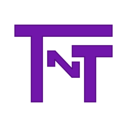

# [Take-N-Teach Learning Platform](https://engineering.ucdenver.edu/current-students/capstone-expo/archived-expos/sp21/csci2)

 

 
This project is an online learning platform featuring courses taught by certified instructors, pay-per-video, offline storage, email composer, etc.

Instructors have the ability to:
* Create a course, upload video to the course, set a price for the course, add tags to the course, and publish the course for the users to purchase.
* Update course information and delete courses. 
* Create calander events with a zoom link for one-on-one or group classes and get in touch with a student via the email composer.

Users have the ability to:
* Search for a course, purchase courses, and view courses they have purchased.
* Email instructors to ask questions or get feedback on their work.
* Create folders, and organize their pictures and videos.

We followed the Software Development Life Cycle (SDLC) structure in two semesters where we worked 1-1 with a client.

The following were the 6 stages of SDLC:
* Stage 1: Planning and Requirement Analysis. We started the project by first meeting with our client and started creating a requirements document. 
* Stage 2: Defining requirements: We then moved onto creating a Software Requirement Specification document to be approved by our professor. 
* Stage 3: Design: We researched different technologies and presented them to the client and defined the architechture of the project.
* Stage 4: Development: We ended our first semester with a prototype. We continued working on the prototype the following semester until testing.
* Stage 5: Testing: Our client gathered a list of testers along with some classmates. The prototype was deployed as an app and was tested using Apple's TestFlight. We continued working on the prototype taking feedback from the testers and fixing bugs.
* Stage 6: Deploy: We finished the deployment stage at the end of the semester. 

Tech Stack:
* **Programming Language:** TypeScript
* **Frontend:** Ionic Framework, Angular, HTML, CSS
* **Backend:** NodeJS, ExpressJS, MongoDB, Google Cloud

Links
* **REST API Source Code:** [https://github.com/abyel26/takenteach-api](https://github.com/abyel26/takenteach-api)
* **Project Showcase:** [https://engineering.ucdenver.edu/current-students/capstone-expo/archived-expos/sp21/csci2](https://engineering.ucdenver.edu/current-students/capstone-expo/archived-expos/sp21/csci2)
